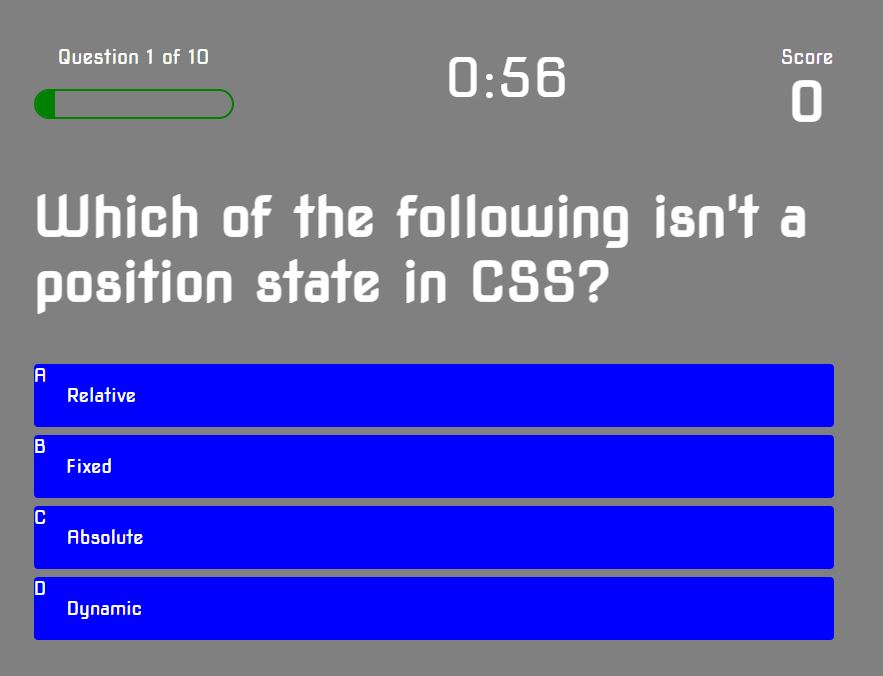

# Code_Quiz
Timed Code Quiz

Test your coding knowledge by taking a timed coding quiz.

The Quiz is comprised of 10 questions.

Rules:

1. You'll have 60 seconds to answer as many questions as possible.
2. You'll get points for your correct answers.
3. You'll lose time if you answer a question wrong.

Link: https://cj8355.github.io/Code_Quiz/

Technologies used:
CSS
HTML
JS

Contact Info:
email: charlescallender.cc@gmail.com

